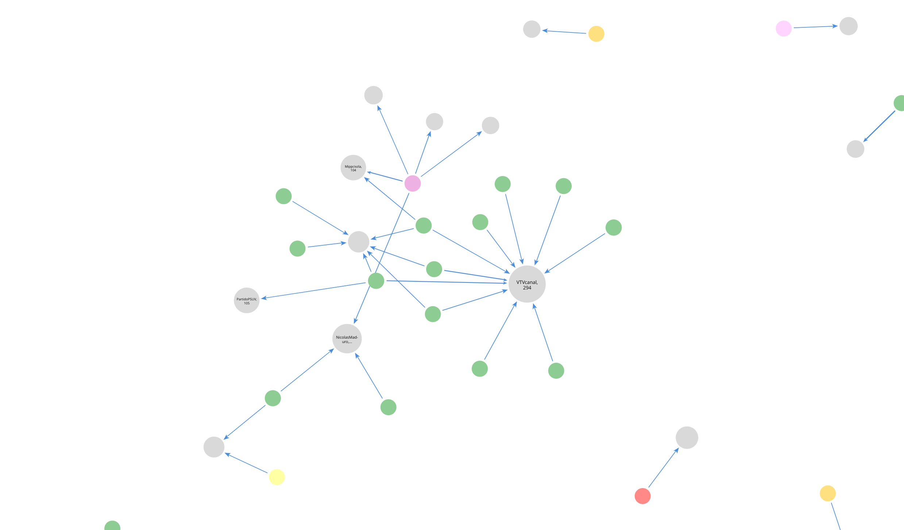

# twitter-data-analysis
This project has for goal to analyse data from Twitter by listening to the 1% stream  
It fetches data from Twitter stream then store it in a document MongoDB Database then convert it into a graph Neo4J database.  
Thanks to the graphs, we can analyse the tweets. The analysis is about the interaction of the users between them.

## Analysis
The result of this project is a graph database describing the interaction between the different users on the Twitter platform. The graph is represented by User nodes with one sided relation toward another user (or themselves). An interaction is noted when a tweet mention an user (reply or retweet). On each users the number of time an user has been mentioned is noted so we can discern how much clout an user has generated.  

It also get the language of the tweet.

## Dependencies : 
* NodeJS
* Python 3.x (Might work with python 2.7+, haven't tested it)
* Any python notebook software
* MongoDB
  * PyMongo (python)
  * MongoDB driver (NodeJS)
* Neo4J
  * Neo4J (python)
* Twitter developer portal access (it doesn't use limited/paid access)

## Two parts
It is actually a 2 part project which contain the data streaming part :
* The NodeJS stream listener that feeds the MongoDB Database
* The python notebook that convert the document MongoDB Database to the graph Neo4J

## Part 1 : NodeJS
Create a ``.env`` file on the root of the project and add these values : 
```dotenv
TWITTER_KEY=your_twitter_key
TWITTER_KEY_SECRET=your_twitter_key_secret
TWITTER_BEARER=your_twitter_bearer
TWITTER_ACCESS=your_twitter_access
TWITTER_ACCESS_SECRET=your_twitter_access_secret

MONGODB_HOST=mongodb://[your_mongodb_url}:{your_mongodb_port}/{args}
```
Then you can run these command to start the script : 
```shell
npm install 
npm run start
```

## Part2 : Neo4J
First, you must install a few dependencies 
```shell
pip install pymongo neo4j
```
Then you must change the variables in it before executing the notebook.

## Visualisation 
I use Neo4J Bloom to visualize the graphs but any graph visualizer software can be used.
From the Neo4J Desktop app, it is possible to export the entire database and use it on the visualizer of your choice.

## Issues 
* Some data processed seem wrong
* Really long process. I calculated about 5 days for 7.3 Million of tweets to process.
* Might be more practical to directly convert streamed tweet to Neo4J. 

## Results examples

I used this cypher to generate this result : 
```Neo4J
MATCH p=(a:User)-[r:speaksOf]->(b:User) 
WHERE 
    a.weight > 0 AND 
    b.weight > 10 AND 
    a.name IS NOT NULL AND 
    a.name <> "" AND 
    b.name <> "" 
    RETURN p
```
This cypher shows only node that generate interaction from other people on them more than 10 time and removes people that generate 0 interaction on them. 

This is the full graph of 150 000 tweets processed. Those screenshot are taken from Neo4J Bloom.


A view on the turkish cluster. Orange dot are for flagged turkish users and gray are for unknown. But we could guess they are mostly turkish people in there. From what I understand, president election is happening soon so it might be why there is so much interaction between turkish people.


The spain cluster was also a bit active.


Small cluster of the news channels.

